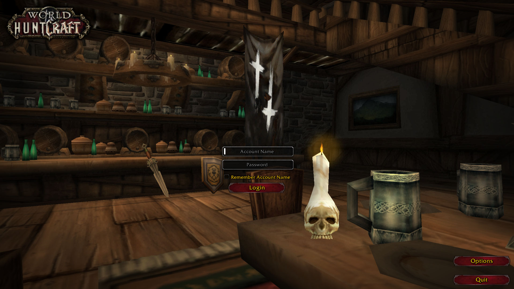
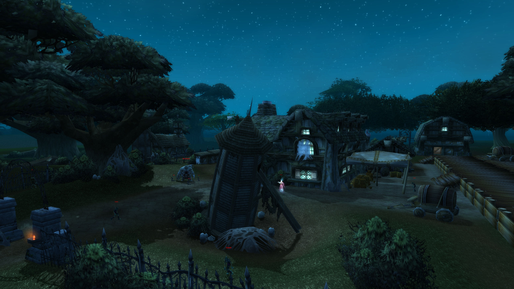
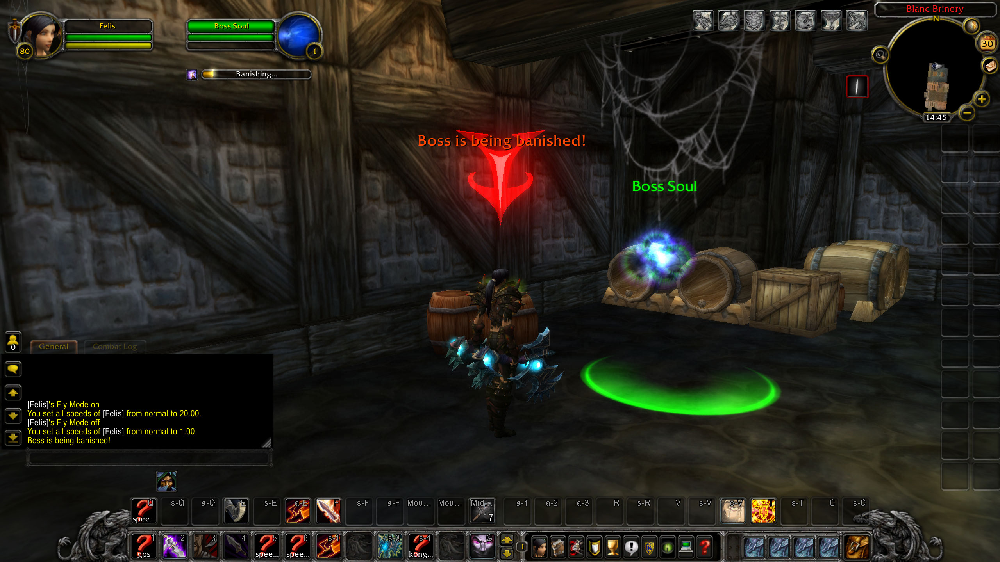
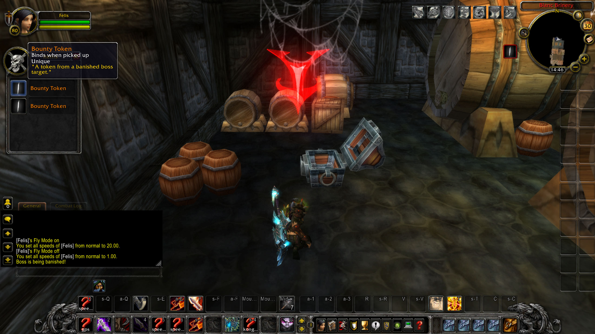
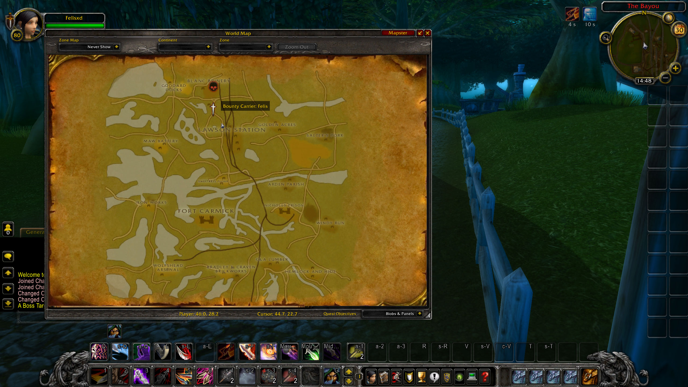

  

A WoW 3.3.5 modding project that combines the game mechanics and world of Hunt: Showdown and World of Warcraft created over the course of 1 month. In this repository you'll find the client patch and Eluna scripts needed to run it yourself or just see how it was made. 

**Fair warning:** this is more like a proof of concept, the scripting is kinda awful, there are bugs and not a lot to do other than the most basic gameplay loop.

Full Screenshot showcase: https://imgur.com/a/F2yb7Sm 

# Features
- Map based on the "Lawson Delta" Hunt map.
- Boss spawning and bounty system scripting.
- Custom AI scripting.
- Client-side UI for map markers and boss announcements.
- Custom Login- and Character Select-screens.
- New items, consumables, NPCs and vendors.

# Instructions

*(prior experience with WoW Modding is recommended)*

1. Find and download a WoW 3.3.5.12340 client.
2. Pack the contents of "PATCH-V.MPC" folder into a WoW 3.3.5 MPQ-patch using MPQEditor and place it in your Data folder. (Or run it unpacked with a patched client)
3. Download or build TrinityCore with Eluna: https://github.com/ElunaLuaEngine/ElunaTrinityWotlk
4. Place the "lua_scripts" folder inside your TrinityCore+Eluna folder.
5. Setup your server: https://trinitycore.info/install/Core-Installation/windows-core-installation
6. Once TrinityCore has set up the database for you: Run the "huntcraft world.sql" SQL-file, this should add the missing server db entries for you.
7. Copy the .dbc files from "PATCH-V.MPC/DBFilesClient" into your server "dbc" folder.
8. Should be good to go.

Once in game teleport to map id: 725.

# Videos: 

# Credits
**Moldred:** Login-Screen Framework (original release seems to be lost to time but a reupload can be found here: https://github.com/haephaistoss/LoginScreen-by-Mordred) 
